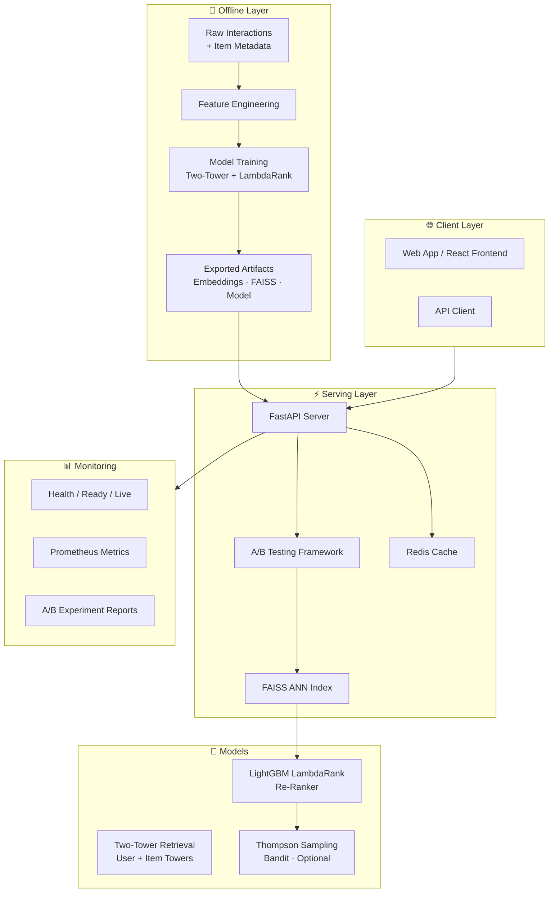
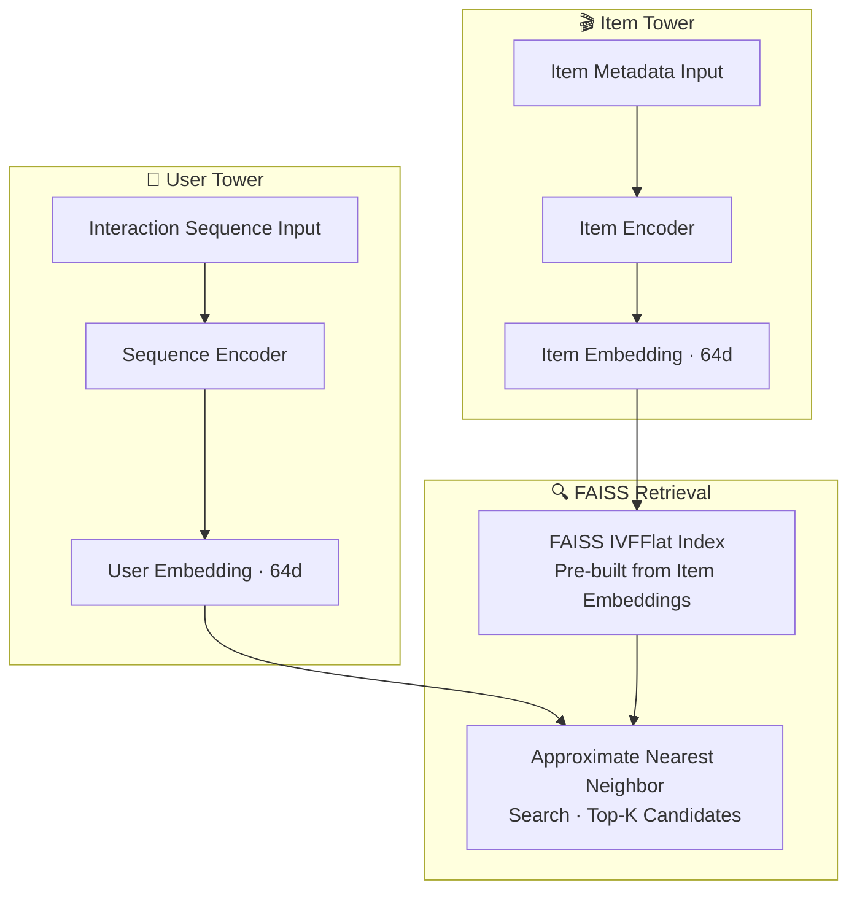
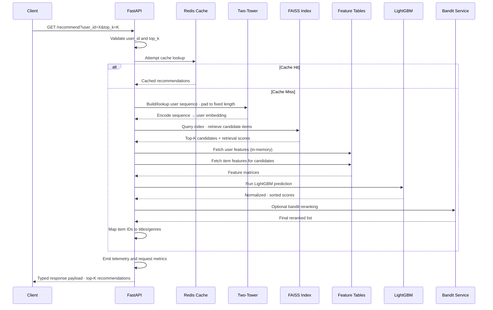
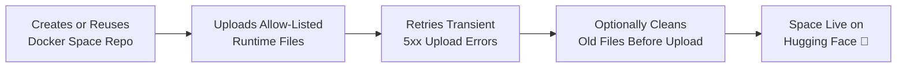

# 🎬 Production-Style Movie Recommendation System


> **An end-to-end recommendation platform built around a hybrid retrieval + ranking architecture and deployed as a fullstack application.** This project demonstrates a complete recommender lifecycle — from raw interactions and feature engineering, through neural retrieval and learning-to-rank, to online inference, feedback capture, and monitoring.

---

## 📑 Table of Contents

- [Project Overview](#-project-overview)
- [Live Demo](#-live-demo)
- [1) Project Objective](#1-project-objective)
- [2) End-to-End Architecture](#2-end-to-end-architecture)
  - [2.1 Offline Layer](#21-offline-layer-data--model-preparation)
  - [2.2 Online Layer](#22-online-layer-serving--feedback)
  - [2.3 Monitoring + Experimentation](#23-monitoring--experimentation)
- [3) Core Technical Components](#3-core-technical-components)
- [4) Online Recommendation Flow](#4-online-recommendation-flow-detailed)
- [5) Health Model Semantics](#5-health-model-semantics)
- [6) API Endpoints](#6-api-endpoints)
- [7) Final Project Structure](#7-final-project-structure-github-clean)
- [8) Tooling and Stack](#8-tooling-and-stack)
- [9) Local Development Setup](#9-local-development-setup)
- [10) Hugging Face Spaces Deployment](#10-hugging-face-spaces-deployment)
- [11) GitHub Push Policy](#11-github-push-policy-used-in-this-project)
- [12) Current Status](#12-current-status)

---

## 🎯 Project Overview

The project combines:

| Component | Description |
| :--- | :--- |
| **Offline Data Engineering** | Feature generation from raw user interaction history and item metadata |
| **Neural Retrieval (Two-Tower + FAISS)** | Fast candidate generation across the full catalog |
| **Learning-to-Rank (LightGBM LambdaRank)** | Precision re-ranking of retrieved candidates |
| **Online Adaptation (Bandits)** | Optional Thompson Sampling for exploration/exploitation |
| **A/B Experimentation & Monitoring** | Traffic splitting, CTR tracking, and significance testing |
| **FastAPI Serving Backend** | Low-latency endpoints with health/readiness/liveness probes |
| **React Dashboard Frontend** | Recommendation UI, A/B dashboard, and health visualization |

The goal is to demonstrate a complete recommender lifecycle from raw interactions to online inference, feedback capture, and monitoring.

### What Makes This Production-Style?

```
┌─────────────┐    ┌──────────────┐    ┌─────────────┐    ┌──────────────┐
│  Data Layer  │───▶│  Training &  │───▶│  Serving &  │───▶│ Monitoring & │
│  - Ingest    │    │  Evaluation  │    │  A/B Testing │    │Observability │
│  - Features  │    │  - Two-Tower │    │  - FastAPI   │    │ - Prometheus │
│  - Sequences │    │  - LambdaRank│    │  - FAISS     │    │ - Metrics    │
│  - Store     │    │  - MLflow    │    │  - Redis     │    │ - Dashboard  │
└─────────────┘    └──────────────┘    └─────────────┘    └──────────────┘
```

---

## 🌐 Live Demo

| Resource | Link |
| :--- | :--- |
| **Hugging Face Space** | https://huggingface.co/spaces/krishnakumar19/ds19-recommender-api |
| **Hugging Face Repository** | https://huggingface.co/spaces/krishnakumar19/ds19-recommender-api/tree/main |

---

## 1) Project Objective

This project solves a practical recommendation problem:

- **Input:** user interaction history and item metadata
- **Output:** relevant top-k movie recommendations in real time

Instead of using one model for everything, DS19 follows a **two-stage architecture**:

| Stage | Name | Purpose |
| :--- | :--- | :--- |
| **Stage 1** | Retrieval | Quickly narrow the full catalog to strong candidates |
| **Stage 2** | Ranking | Deeply score and reorder candidates for precision |

This mirrors production recommender stacks where speed and quality must both be optimized.

---

## 2) End-to-End Architecture



### 2.1 Offline Layer (Data + Model Preparation)

1. Load and validate source data.
2. Build user/item index mappings.
3. Construct user interaction sequences.
4. Engineer user/item/context features.
5. Train retrieval and ranking models.
6. Export artifacts needed for low-latency serving.

### 2.2 Online Layer (Serving + Feedback)

1. Receive recommendation request via API.
2. Build user representation from interaction sequence.
3. Retrieve candidate items using FAISS ANN search.
4. Build ranking feature matrix for candidates.
5. Predict ranking scores with LightGBM.
6. Optionally apply bandit reranking.
7. Return final top-k recommendations.
8. Record feedback and update online components.

### 2.3 Monitoring + Experimentation

1. Poll `/health` for component-level status.
2. Track latency and cache hit metrics.
3. Split traffic by A/B variants.
4. Compare CTR and significance statistics.

---

## 3) Core Technical Components

### 3.1 Retrieval Model



- Two-Tower encoder computes user and item embeddings.
- FAISS stores item embeddings for nearest-neighbor search.
- Retrieval is optimized for speed and recall.

### 3.2 Ranking Model

- LightGBM LambdaRank reranks retrieved candidates.
- Features include retrieval signals, user features, item features, and interaction features.
- Ranking is optimized for top-k quality.

| Feature Category | Examples |
| :--- | :--- |
| **Retrieval Signal** | FAISS similarity score |
| **User Features** | rating count, mean rating, std rating, active days, genre diversity |
| **Item Features** | rating count, mean rating, std rating, days active |
| **Interaction Features** | sequence recency, interaction frequency |

### 3.3 Bandits (Optional Online Adaptation)

- Thompson Sampling updates item-level posteriors from feedback.
- Can blend with ranker outputs for exploration/exploitation.
- Gracefully degrades when Redis is disabled or unavailable.

### 3.4 API Layer

- FastAPI provides low-latency endpoints.
- Includes health/readiness/liveness probes.
- Exposes metrics for observability.

### 3.5 Frontend Layer

- React + TypeScript frontend for recommendation UI and monitoring.
- Includes A/B dashboard and health visualization.
- Built with Vite and served from the same Docker runtime in Hugging Face Spaces.

---

## 4) Online Recommendation Flow (Detailed)



### `GET /recommend` — Step-by-Step

1. Validate `user_id` and `top_k`.
2. Attempt cache lookup (if Redis enabled).
3. Build/lookup user sequence and pad to fixed length.
4. Encode sequence with Two-Tower user tower.
5. Query FAISS index to retrieve candidate items.
6. Fetch in-memory feature tables for user and candidates.
7. Construct ranking feature matrix.
8. Run LightGBM prediction.
9. Normalize and sort scores.
10. Optionally rerank with bandit service.
11. Map item IDs to titles/genres.
12. Return typed response payload.
13. Emit telemetry and request metrics.

### `POST /feedback` — Step-by-Step

1. Persist feedback event log.
2. Invalidate cache for affected user.
3. Update bandit posterior if enabled.
4. Log A/B conversion event.

---

## 5) Health Model Semantics

Health endpoint returns:

| Component | Field | Description |
| :--- | :--- | :--- |
| **Models** | `components.models` | Model loading and serving status |
| **Feature Layer** | `components.feast` | In-memory feature store status |
| **Cache** | `components.redis` | Cache service status |

**Important behavior in single-container cloud runtimes:**

- If Redis is intentionally disabled (`REDIS_ENABLED=false`), Redis reports `disabled`.
- Overall system can still report `healthy` when core serving components are healthy.

```
Redis Enabled? ──Yes──▶ components.redis = "healthy" | "unhealthy"
      │
     No
      │
      ▼
components.redis = "disabled"
Overall status = "healthy" (if models + feast are healthy)
```

---

## 6) API Endpoints

### Recommendation APIs

| Endpoint | Method | Description |
| :--- | :--- | :--- |
| `/recommend` | GET | `user_id=<int>&top_k=<int>` — personalized recommendations |
| `/recommend/by-movie` | GET | `movie_title=<str>&top_k=<int>` — item-to-item recommendations |
| `/recommend/movie-suggestions` | GET | `query=<str>&limit=<int>` — autocomplete / search |

### Feedback + Experiment APIs

| Endpoint | Method | Description |
| :--- | :--- | :--- |
| `/feedback` | POST | Submit user feedback event |
| `/ab/report` | GET | Retrieve A/B experiment results |

### System + Monitoring APIs

| Endpoint | Method | Description |
| :--- | :--- | :--- |
| `/health` | GET | Component-level health status |
| `/ready` | GET | Readiness probe |
| `/live` | GET | Liveness probe |
| `/metrics` | GET | Prometheus metrics export |
| `/docs` | GET | Interactive API documentation (Swagger) |

---

## 7) Final Project Structure (GitHub-Clean)

The structure below reflects the intended push layout and core modules.
Files/folders starting with `week` and `WEEK_VISE/` are excluded from GitHub by policy.

```text
DS19/
├─ backend/
│  ├─ app/
│  │  ├─ api/                # HTTP route handlers
│  │  ├─ core/               # config + model loading
│  │  ├─ middleware/         # request/latency logging middleware
│  │  ├─ schemas/            # pydantic request/response models
│  │  ├─ services/           # retrieval/ranking/pipeline/cache logic
│  │  ├─ metrics.py          # prometheus metrics definitions
│  │  └─ main.py             # FastAPI app entrypoint
│  └─ requirements.txt
├─ data/
│  ├─ download_dataset.py
│  ├─ generate_processed_data.py
│  ├─ raw/                   # source/raw artifacts (selective)
│  ├─ processed/             # processed mappings/meta (selective)
│  ├─ features/              # feature tables used at inference
│  ├─ sequences/             # sequence artifacts used at inference
│  ├─ splits/
│  └─ events/
├─ feature_store/
│  ├─ feature_repo/
│  ├─ pipelines/
│  ├─ services/
│  ├─ training/
│  └─ tests/
├─ frontend/
│  ├─ src/
│  │  ├─ api/
│  │  ├─ components/
│  │  ├─ hooks/
│  │  ├─ pages/
│  │  └─ types/
│  ├─ public/
│  ├─ package.json
│  └─ vite.config.ts
├─ mlops/
│  ├─ ab_testing/
│  ├─ bandits/
│  ├─ mlflow_setup/
│  ├─ reports/
│  └─ ci_cd/
├─ models/
│  ├─ two_tower/
│  ├─ ranking/
│  ├─ matrix_factorization/
│  ├─ transformer/
│  └─ saved/                 # exported model artifacts (selective)
├─ retrieval/
│  ├─ retrieve.py
│  ├─ faiss_index.py
│  └─ faiss artifacts
├─ tests/
│  ├─ unit/
│  └─ integration/
├─ Dockerfile
├─ docker-compose.yml
├─ requirements.txt
├─ requirements-dev.txt
├─ script_deploy_hf_space.py
└─ README.md
```

---

## 8) Tooling and Stack

| Category | Technologies |
| :--- | :--- |
| **Language** | Python 3.10, TypeScript |
| **Backend** | FastAPI, Uvicorn, Pydantic |
| **Frontend** | React, React Query, Vite, Tailwind |
| **ML — Retrieval** | PyTorch (Two-Tower), FAISS |
| **ML — Ranking** | LightGBM LambdaRank |
| **ML — Utilities** | scikit-learn |
| **MLOps** | MLflow, A/B logging, bandit feedback loops |
| **Cache / Online State** | Redis (optional in cloud runtimes) |
| **Deployment** | Docker, Hugging Face Spaces (Docker SDK) |

---

## 9) Local Development Setup

### 9.1 Backend Setup

1. Create and activate Python environment.
2. Install dependencies from `requirements.txt`.
3. Ensure required artifacts exist in:
   - `data/processed/`
   - `data/features/`
   - `data/sequences/`
   - `models/saved/`
   - `retrieval/`
4. Start backend:

```bash
python -m uvicorn backend.app.main:app --host 0.0.0.0 --port 8000
```

5. Open API docs at `http://localhost:8000/docs`.

### 9.2 Frontend Setup

1. Move to `frontend/`.
2. Install dependencies.
3. Start Vite dev server.

```bash
npm install
npm run dev
```

4. Open UI at `http://localhost:5173`.

### 9.3 Fullstack Docker (Local)

Use the provided Docker assets to run integrated services where needed.

```bash
# Start all services
docker-compose up -d

# Services:
# - API:      http://localhost:8000
# - Frontend: http://localhost:5173
# - Redis:    localhost:6379
```

---

## 10) Hugging Face Spaces Deployment

The project includes an automated deployment helper:

- `script_deploy_hf_space.py`

Typical deployment command:

```bash
python script_deploy_hf_space.py --clean
```

### What it does



1. Creates/uses a Docker Space repo.
2. Uploads only allow-listed runtime files.
3. Retries transient 5xx upload errors.
4. Optionally cleans old files before upload.

---

## 11) GitHub Push Policy Used in This Project

To keep the repository focused and maintainable:

| Rule | Details |
| :--- | :--- |
| ❌ Do not push | `WEEK_VISE/` directory |
| ❌ Do not push | Files/folders whose names start with `week` (case-insensitive) |
| ❌ Do not push | Non-essential empty placeholder files |
| ❌ Avoid committing | Local runtime artifacts, virtual environments, caches, and logs |

These rules are enforced through `.gitignore` and curated staging.

---

## 12) Current Status

### ✅ Completed

| Feature | Status |
| :--- | :--- |
| End-to-end retrieval + ranking API | ✅ Done |
| Frontend integration and dashboarding | ✅ Done |
| Health/readiness/liveness and metrics | ✅ Done |
| Redis-disabled cloud fallback semantics | ✅ Done |
| Hugging Face Docker Space deployment flow | ✅ Done |

### 🔄 In Progress / Extendable

| Feature | Status |
| :--- | :--- |
| Richer online learning policies | 🔄 In progress |
| Stronger experiment automation | 🔄 In progress |
| Additional ranking feature families | 🔄 In progress |
| Continuous retraining automation | 🔄 In progress |

---

## 🚀 Onboarding

If you are onboarding to this project, start with:

| Order | File | Purpose |
| :---: | :--- | :--- |
| 1 | `backend/app/main.py` | Application entrypoint |
| 2 | `backend/app/services/pipeline_service.py` | Serving pipeline |
| 3 | `backend/app/core/model_loader.py` | Artifact loading |
| 4 | `frontend/src/pages/ABDashboard.tsx` | Health + experiment UI |
| 5 | `script_deploy_hf_space.py` | Deployment automation |

---

<div align="center">

**Built as a demonstration of a production-style recommender lifecycle**

_From raw interactions → feature engineering → neural retrieval → learning-to-rank → online serving → monitoring_

</div>
